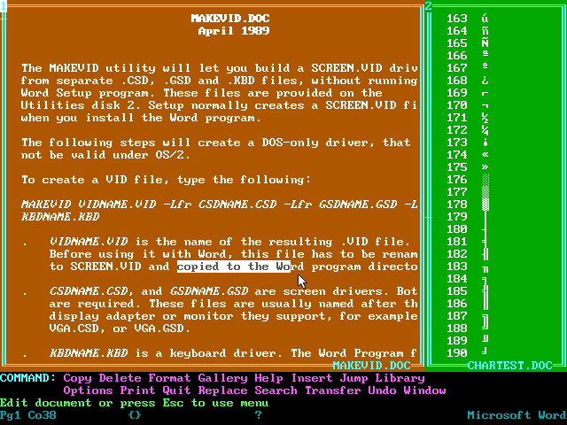

---
notes: |
    - Why Command Line 10min (Nils)
      - full control
        - Instead of a magic button, you decide what happens. This also gives you the opportunity to go through builds step-by-step if something doesn't work. If an IDE doesn't support a certain build tool anymore, it is still accessible to you.
      - transparency
        - important to the understanding (what happens when i click build)
        - probably much more transparent error messages, because that's just how it's been for years. -> andork studio image
      - reproducibility
        - kind of a no-brainer. If something doesn't go the way you expect it to: Again, full control. 
      - efficiency
        - with custom bash scripts
      - Consistency
        - shell doesn't really change much over the years
        - see opera, firefox, thunderbird, chrome, android, iphone, youtube... 
...

# CLI

## What are "CLI" tools?

### What are "CLI" tools?

###

## Why use them?

### Why?

- Full Control
- Transparency
- Reproducibility
- Efficiency
- Consistency

### Full Control

- Reduces the magic
- You're not dependent on an IDE

### Transparency

- Again, no magic.
- Greater learn effect

### Reproducibility

### Efficiency

- Custom bash scripts
- Other shells (zsh, fish, ...)
- Great array of commands at your disposal

### Consistency

CLI is archaic

###
<!-- Picture of Word 30 years ago.-->
{ width=50% }

