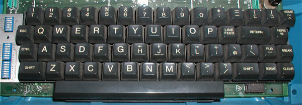

# Vim Basics

## What Vim Is And Isn't

### Vim is an editor

...but probably unlike anything else you've ever used. 

And extremely powerful.

### Configurability

#### Vimscript

- Remap keys
- Write whole plugins!

## Modal Editing

### Vim Modes

- Insert Mode
- Visual Mode
- Command-Line Mode
- Normal Mode

### Insert Mode

- Does what any other editor does

### Visual Mode
	
- Selecting text

### Command-Line Mode

- Execute built-in vim commands
- Execute any shell command!

### Normal Mode
	
- Magic and hjkl.

### 

{ width=50% }

###

{ width=80% }

# Getting Faster

## Learning Vim

### How To "Grok" Vim

#### Some basic vim terminology
- Verbs
- Motions
- Objects

### Productivity Tips

- Unmap the arrow keys.
- Learn something new from time to time.
- Actively try to improve your editing.
- Tabs, Splits
- Ctrl-Z
- Watch some talks online: "Write Code Faster: Expert-Level Vim"
- Learn Vimscript the Hard Way.

# Plugins

## Plugins

### Vim Is not an IDE
	
- But it can be.

### NERDTree

### FileType
