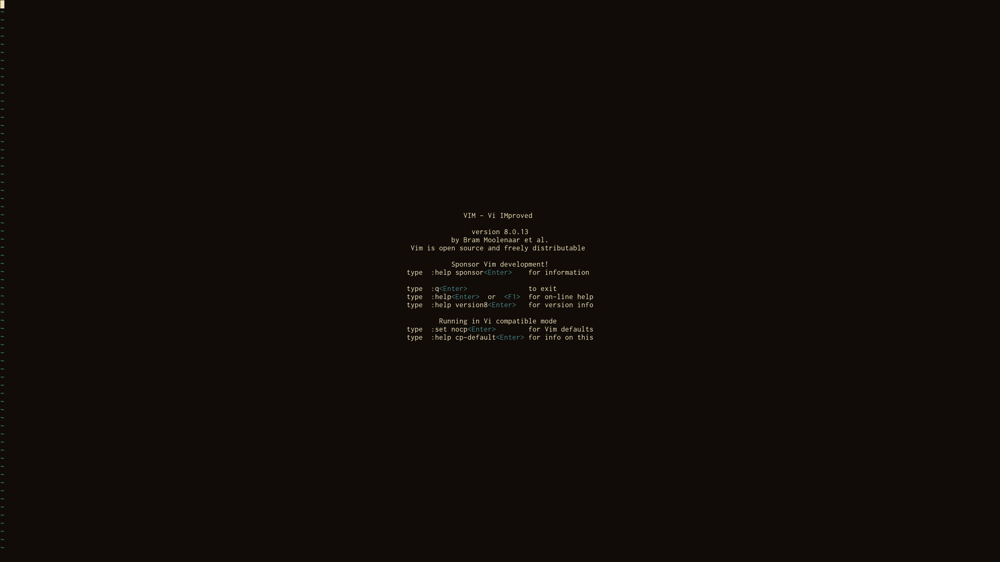
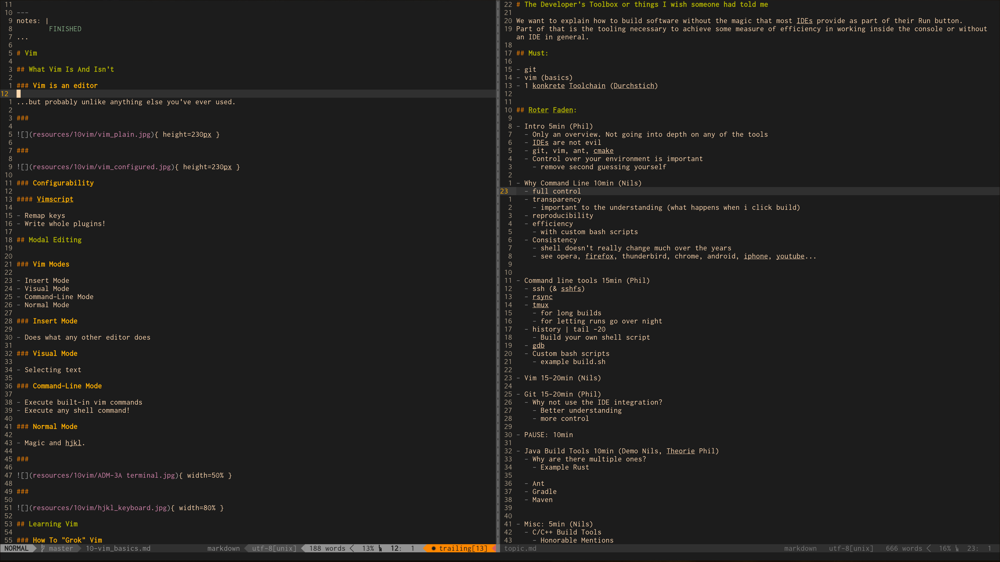
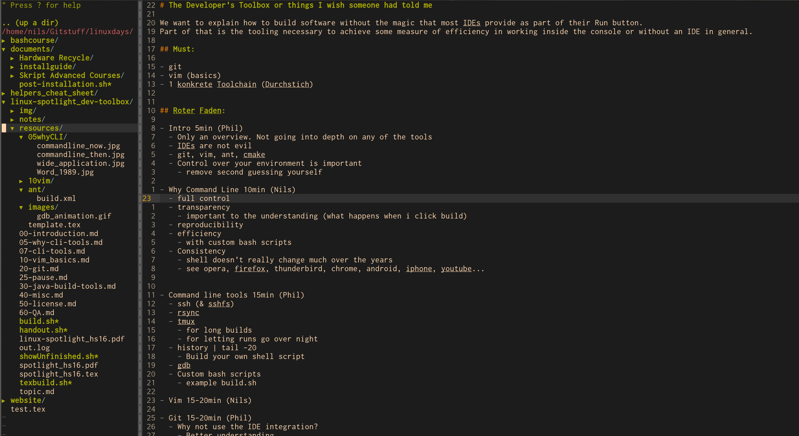

---
notes: |
	FINISHED
...

# Vim

## What Vim Is And Isn't

###

{ height=230px }

###

{ height=230px }   

### Vim is an editor

- Extremely powerful
- Unlike anything you've ever used

### Configurability

#### Themes
<!-- "This is not what I suggest you start out with!" -->

- Gruvbox, Molokai, Jellybeans, Badwolf, Solarized, Dracula, ...
- http://vimcolors.com/

#### Vimscript

- Remap keys
- Write whole plugins!

## Modal Editing

### Vim Modes

- Insert Mode
- Visual Mode
- Command-Line Mode
- Normal Mode

### Insert Mode

- Does what any other editor does

### Visual Mode
	
- Selecting text

### Command-Line Mode

- Execute built-in vim commands
- Execute any shell command!

### Normal Mode 

- Wizardry and hjkl 

###

{ width=50% }

###

{ width=80% }

## Learning Vim

### How To "Grok" Vim

#### Some basic vim terminology
- Verbs
- Motions
- Objects

#### Vimtutor

### Productivity Tips

- _Unmap the arrow keys._
- Learn something new from time to time.
- Actively try to improve your editing.
- Watch some _talks_ online: "Write Code Faster: Expert-Level Vim"
- _Book_: Practical Vim
- _Youtube_: Thoughtbot
- http://vimcasts.org

## Plugins

### Vim Is not an IDE
	
- But it can be. (Almost)

### NERDTree

{ height=230px }

### Some more:

- Commenter
- Surround
- Easymotion
- http://vimawesome.com/

