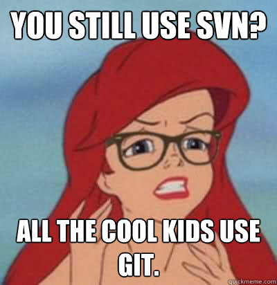
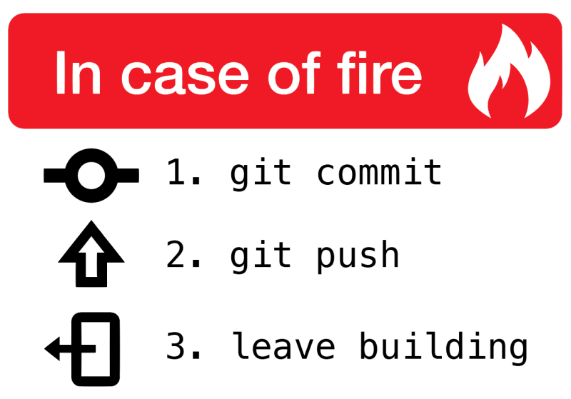

---
notes: |
    TODO
    - Git 15-20min (Phil)
      - Why not use the IDE integration?
        - Better understanding
        - more control
...

# Git

## Introduction

### Version Control Systems

- Version Control System (VCS)
    - Keeps old versions
    - Centralized "Master" copy
    - Ability to record a reason for a change
- Why?
    - See above!

---

#### CVS
 { height=41% }

---

#### SVN
 { height=41% }

---

#### Git
 { height=41% }

### History

- First release 11 years ago
- Built for large codebases
    - Linux Kernel (*Millions* of lines)
- Works well for small projects too
    - Your programming exercises ;) 
- **Stigma of complexity**

### Questions

- Who has heard of Git? (before today)
- Who used Git before?
- Who was forced to use Git?
- Who feels comfortable with it?
- Why not? { width=17px }
- Who thinks it's black magic?

---

#### While we're on the topic...

{ height=41% }

### Complexity

- Single-user version control is hard...
    - Manage Versions
    - Record Changes

---

- Multi-user version control is really hard!
    - Conflict resolution
    - Branching
    - Sharing

### Stop! Story Time

- Demo our repository with
    - Command line
    - git cola

### Recommendations

- `tig`
- `git cola`

