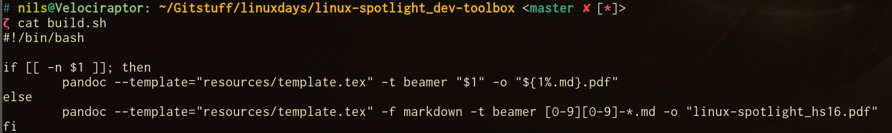

---
notes: |
    - Misc: 5min (Nils)
      - C/C++ Build Tools
        - Honorable Mentions
          - qmake
          - autoconf
          - etc.
        - cmake/makefiles
        - unit test runner 
...

# Misc

## Misc

### Misc General Tools
- ssh (see Sandro's courses)
- rsync
- tmux
  - "Terminal Multiplexer"
  - For long builds
- pandoc with custom bash scripts!

### 
{ width=90% }

### Misc Build tools
- C/C++ build tools:
  - autoconf
  - qmake
  - cmake
  - makefiles
  - unit test runner
- Debuggers:
  - gdb
  - Valgrind
